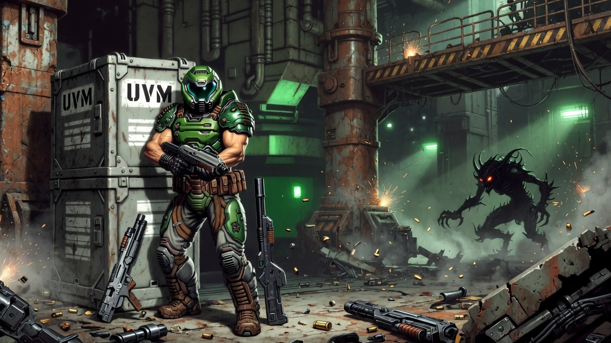

# uvm-doom

A port of Doom that runs on the [UVM virtual machine](https://github.com/maximecb/uvm). Based on
[PureDOOM](https://github.com/Daivuk/PureDOOM), with a few performance optimizations to make it
run smoothly on UVM, and a simple MIDI synth so we can enjoy Doom's badass soundtrack.

<p align="center">
  
</p>

## Getting the code

This repo uses [UVM](https://github.com/maximecb/uvm) as a git submodule (in
`uvm/`), so clone with `--recurse-submodules`:

```bash
git clone --recurse-submodules https://github.com/maximecb/uvm-doom.git
```

If you already cloned without it, pull the submodule in:

```bash
git submodule update --init --recursive
```

## Building and running

```bash
./build_and_run.sh
```

This compiles `main.c` to `out.asm` with uvclang and runs it on the UVM VM.
Any extra arguments are forwarded to Doom. `out.asm` is cached; delete it to
force a rebuild.

> Note: UVM's clang backend is sensitive to the LLVM IR it receives from clang.
> If the build fails, you may need to upgrade your version of clang.

## License

This project is licensed under the **GNU General Public License, version 2** —
see [LICENSE](LICENSE).

The Doom engine (`PureDOOM.h`) is derived from the Doom source code released by
id Software, Inc. and remains **Copyright (C) 1993-1996 id Software, Inc.**
id Software relicensed the Doom source under the GPL in 1999; the original
copyright notices are preserved as the GPL requires.

New code written for this UVM port is **Copyright (C) 2026 Maxime
Chevalier-Boisvert** and is likewise released under the GPL v2.

The bundled [UVM](https://github.com/maximecb/uvm) submodule is a separate work
under the **Apache License 2.0** and is not covered by this repository's GPL.

> Note: the `doom1.wad` shareware data file is **not** covered by the GPL. It is
> distributed under id Software's original shareware terms and may not be sold.
